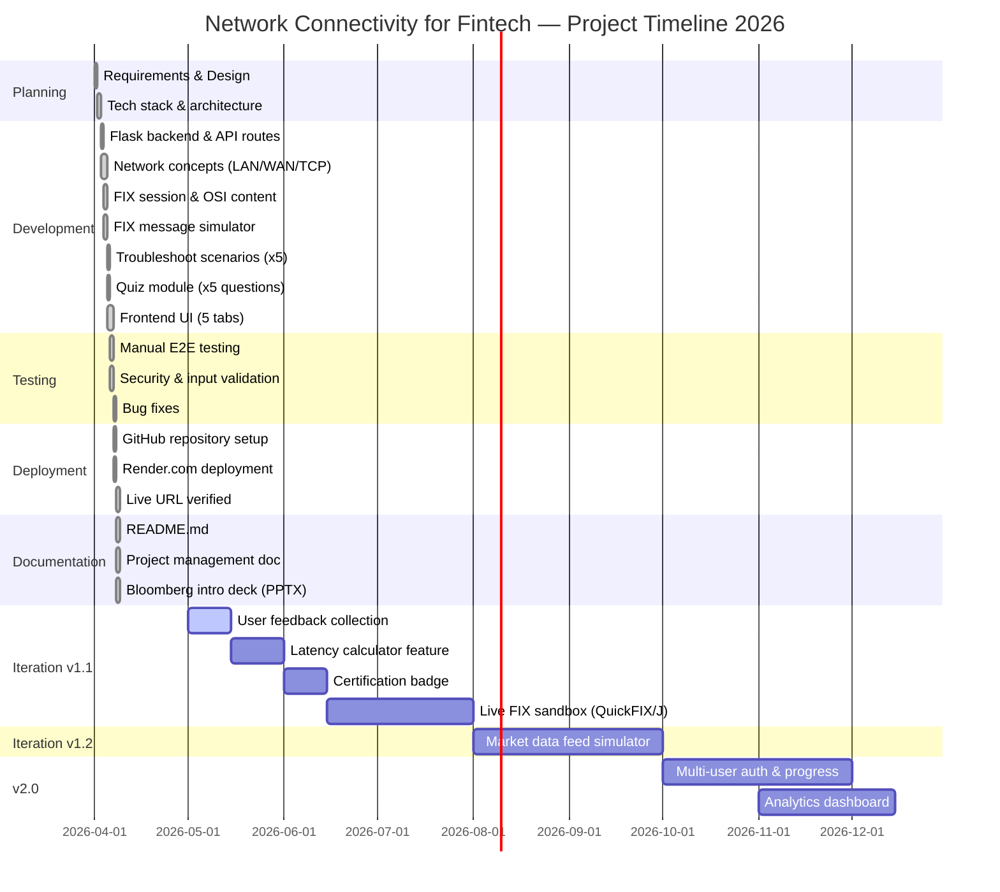

# Network Connectivity for Fintech
## Project Management Document

**Project Name:** Network Connectivity for Fintech — Interactive Learning Platform  
**Version:** 1.0  
**Date:** April 2026  
**Owner:** Ken Jiang  
**Status:** Active

---

## Table of Contents
1. [Business Justification](#1-business-justification)
2. [Return on Investment (ROI)](#2-return-on-investment-roi)
3. [RACI Matrix](#3-raci-matrix)
4. [Definition of Ready](#4-definition-of-ready)
5. [Definition of Done](#5-definition-of-done)
6. [Milestones](#6-milestones)
7. [Feature Prioritisation — RICE Model](#7-feature-prioritisation--rice-model)
8. [Testing Plan](#8-testing-plan)
9. [Software SDLC](#9-software-sdlc)
10. [Gantt Chart](#10-gantt-chart)

---

## 1. Business Justification

### Problem Statement
Network connectivity is the invisible backbone of every financial transaction. Fintech professionals — including FIX connectivity engineers, algo traders, and operations staff — frequently encounter challenges such as:

- **FIX session drops** — Heartbeat timeouts and TCP connection resets halt order flow, causing missed trades and financial loss during volatile markets
- **Latency blind spots** — Engineers do not understand the LAN vs WAN vs microwave latency trade-offs that directly impact algo trading P&L
- **Sequence number gaps** — ResendRequest loops and SequenceReset errors stop trading sessions; resolving them requires deep TCP and FIX session knowledge
- **Slow onboarding** — New fintech engineers take months to understand how LAN, WAN, TCP/IP, and FIX protocol interconnect in a live trading environment
- **Knowledge silos** — Network and FIX expertise is concentrated in a few senior engineers; when they leave, institutional knowledge is lost

### Solution
An interactive, browser-based learning platform that teaches LAN, WAN, TCP/IP, and FIX protocol through real fintech scenarios — with a live FIX message simulator, OSI layer explorer, troubleshooting guides, and a knowledge quiz.

### Strategic Alignment
| Strategic Goal | How This Platform Supports It |
|---|---|
| Reduce operational risk | Engineers diagnose FIX session and network issues faster |
| Staff development | Fintech onboarding time reduced with interactive, contextual learning |
| Client satisfaction | Faster FIX connectivity support for counterparties |
| Knowledge retention | Network and FIX concepts encoded in an always-on platform |
| Cost efficiency | Reduces escalation to senior engineers for common network issues |

### Stakeholders
| Stakeholder | Role | Interest |
|---|---|---|
| FIX Connectivity Engineers | Primary users | Debug session drops, sequence gaps, heartbeat timeouts |
| Algo Traders | Primary users | Understand latency impact of LAN vs WAN on fill rates |
| Fintech Onboarding Teams | Primary users | Ramp new hires on network fundamentals quickly |
| Risk & Compliance | Secondary users | Understand FIX message flow for trade reconstruction and audit |
| Senior Engineers | Secondary users | Reduced escalation burden for common network questions |
| Management | Sponsor | Cost reduction and risk mitigation through better-skilled teams |

### Expected Outcomes

Outcomes are organised across three dimensions: **People**, **Process**, and **Business**.

#### People Outcomes
| Outcome | Baseline (Before) | Target (After) | Timeframe |
|---|---|---|---|
| Junior engineer independently diagnoses FIX session drop | Requires escalation ~75% of the time | Resolves independently 65% of the time | 3 months post-launch |
| Onboarding time to network/FIX productivity | 2–3 months to understand TCP/FIX interaction | 3 weeks with platform | First cohort of new hires |
| Senior engineer time on network escalations | ~6 hrs/week answering junior queries | < 2 hrs/week | 2 months post-launch |
| Staff confidence with TCP/IP and FIX networking | Self-reported: 3/10 average | Self-reported: 7/10 average | 6 months post-launch |

#### Process Outcomes
| Outcome | Baseline (Before) | Target (After) | Timeframe |
|---|---|---|---|
| Mean Time to Resolve (MTTR) FIX network incidents | ~2.5 hours per incident | < 45 minutes | 3 months post-launch |
| FIX session drop escalation rate | ~8 escalations/month | < 4 escalations/month | 3 months post-launch |
| Time to identify correct troubleshooting steps | ~60 mins (manual search) | < 10 mins (platform guide) | Immediate on launch |
| OSI layer knowledge during incident response | Ad hoc, inconsistent | Structured, layer-by-layer approach | Immediate on launch |

#### Business Outcomes
| Outcome | Baseline (Before) | Target (After) | Timeframe |
|---|---|---|---|
| Annual cost of FIX network incident resolution | ~$15,000/year in engineer hours | < $7,500/year | 6 months post-launch |
| Client FIX connectivity resolution SLA | 3 hours average | < 1 hour average | 3 months post-launch |
| Trading downtime due to FIX session errors | ~1.5 hrs/month unplanned | < 20 mins/month | 6 months post-launch |
| Platform adoption across FIX/network team | 0% | 80% monthly active users | 2 months post-launch |
| Engineer hours saved per month | 0 hrs | 15+ hrs/month | 1 month post-launch |

#### Outcome Measurement Framework

```
MEASURE → TRACK → REPORT → ITERATE

Monthly review cadence:
  1. Pull incident ticket data  → MTTR, escalation rate
  2. Pull Render access logs    → Monthly active users
  3. Pull quiz completion data  → Learning effectiveness (avg score)
  4. Quarterly staff survey     → Confidence score, qualitative feedback
  5. Management report          → ROI actuals vs targets
```

---

## 2. Return on Investment (ROI)

### Cost of the Platform

| Cost Item | Estimated Cost |
|---|---|
| Development time (one-time) | ~30 hours of engineering effort |
| Hosting on Render.com (per month) | $0 (free tier) to $7 (paid tier) |
| Domain / SSL (optional) | $0 (Render provides HTTPS) |
| **Total Year 1 cost** | **~$84–$168** |

### Value Generated

| Value Driver | Estimate | Basis |
|---|---|---|
| Reduced time per FIX network incident | 1.75 hrs saved per incident | Average incident takes 2.5 hrs; platform cuts to 45 mins |
| Incidents per month (team) | ~8 incidents | Typical mid-size trading firm |
| Hours saved per month | ~14 hrs/month | 8 incidents × 1.75 hrs |
| Cost per engineering hour | $75/hr | Mid-level Fintech engineer blended rate |
| **Monthly savings** | **~$1,050/month** | |
| **Annual savings** | **~$12,600/year** | |

### ROI Calculation

```
ROI = (Annual Savings - Annual Cost) / Annual Cost × 100

ROI = ($12,600 - $126) / $126 × 100 = 9,900%
```

### How to Measure ROI

| Metric | Measurement Method | Target |
|---|---|---|
| Mean Time to Resolve (MTTR) FIX incidents | Track ticket open/close timestamps | Reduce by 70% within 3 months |
| Escalation rate to senior engineers | Count escalation tickets per month | Reduce by 50% within 3 months |
| Onboarding time for new hires | Time to independently handle first FIX network issue | Reduce from 10 weeks to 3 weeks |
| User adoption | Monthly active users of the platform | 80% of FIX team within 2 months |
| Quiz average score | Tracked per session in quiz module | ≥ 70% validates effective learning |
| Client SLA compliance | Client-reported resolution times | Reduce average from 3 hrs to 1 hr |

### Payback Period
At ~$126/year cost and $12,600/year savings, the platform pays for itself in **less than 4 days** of use.

---

## 3. RACI Matrix

### Roles

| Role | Description |
|---|---|
| **PO** — Project Owner | Ken Jiang — accountable for product vision, priorities, and acceptance |
| **DEV** — Developer | Engineer building and maintaining the platform |
| **NET-SME** — Network SME | Network / FIX subject matter expert providing technical accuracy review |
| **OPS** — Operations / Support | End users who troubleshoot FIX and network incidents day-to-day |
| **MGT** — Management | Sponsors who fund and approve the project |
| **USR** — End Users | FIX engineers, algo traders, and new hires using the platform |

### RACI Key
- **R** — Responsible (does the work)
- **A** — Accountable (owns the outcome, signs off)
- **C** — Consulted (provides input before decisions)
- **I** — Informed (kept up to date)

### RACI Table

| Activity | PO | DEV | NET-SME | OPS | MGT | USR |
|---|:---:|:---:|:---:|:---:|:---:|:---:|
| **PLANNING** | | | | | | |
| Define business requirements | A | C | C | C | C | I |
| Approve project scope | A | I | C | I | C | I |
| Technology stack selection | C | A | C | I | I | I |
| Define success metrics / KPIs | A | C | C | C | R | I |
| **DESIGN** | | | | | | |
| UI/UX wireframe design | A | R | I | C | I | C |
| Network concept content design | C | R | A | C | I | I |
| FIX simulator design | C | A | R | I | I | I |
| OSI layer mapping design | C | R | A | I | I | I |
| **DEVELOPMENT** | | | | | | |
| Backend development (Flask, APIs) | I | A/R | C | I | I | I |
| Frontend development (UI, tabs) | I | A/R | I | C | I | C |
| FIX message simulator | I | A/R | C | I | I | I |
| Network concept content (LAN/WAN/TCP/FIX) | C | R | A | C | I | I |
| Troubleshoot scenarios (5 scenarios) | C | R | A | C | I | C |
| Quiz module (5 questions) | C | A/R | C | I | I | R |
| **TESTING** | | | | | | |
| Write unit tests | I | A/R | C | I | I | I |
| Execute integration tests | I | A/R | C | I | I | I |
| User acceptance testing (UAT) | A | C | C | R | I | R |
| Security review (ping input validation) | A | R | C | I | I | I |
| Content accuracy review | C | I | A/R | C | I | I |
| **DEPLOYMENT** | | | | | | |
| GitHub repository setup | I | A/R | I | I | I | I |
| Render.com deployment configuration | I | A/R | I | I | I | I |
| Production go-live approval | A | C | C | I | C | I |
| **DOCUMENTATION** | | | | | | |
| README.md | A | R | C | I | I | I |
| Project management document | A | R | C | I | C | I |
| **MAINTENANCE & OPERATIONS** | | | | | | |
| Monitor uptime and errors | A | R | I | I | I | I |
| Incident response (app downtime) | A | R | C | I | I | I |
| Feature enhancement prioritisation | A | C | C | C | C | R |
| Dependency / security updates | C | A/R | C | I | I | I |
| User feedback collection | A | C | I | R | I | R |

### RACI Summary by Role

| Role | Primary Responsibilities |
|---|---|
| **Project Owner (PO)** | Accountable for scope, priorities, go-live decisions, and success metrics |
| **Developer (DEV)** | Responsible for all technical build, testing, deployment, and maintenance |
| **Network SME (NET-SME)** | Accountable for technical accuracy of all network and FIX protocol content |
| **Operations / Support (OPS)** | Consulted on troubleshooting scenarios; performs UAT; collects user feedback |
| **Management (MGT)** | Consulted on business requirements and ROI; informed of milestones |
| **End Users (USR)** | Consulted on UI/UX; performs UAT; primary source of feature feedback |

---

## 4. Definition of Ready

A user story or feature is **ready to be worked on** when all of the following criteria are met:

### User Story Criteria
- [ ] User story is written in the format: *"As a [fintech professional], I want [feature] so that [benefit]"*
- [ ] Acceptance criteria are clearly defined and testable
- [ ] Story is estimated (story points or time)
- [ ] Dependencies are identified and resolved
- [ ] UI/UX layout or wireframe is approved (for frontend changes)
- [ ] Network/FIX content is technically reviewed by NET-SME (for concept or scenario changes)
- [ ] No blockers or open questions remain

### Technical Criteria
- [ ] Development environment is set up and working (`python src/app.py` runs locally)
- [ ] Flask routes and API contracts are agreed
- [ ] Test data or FIX message samples are available for the feature
- [ ] Input validation approach is defined (e.g. for ping tool)

### Business Criteria
- [ ] Business owner has reviewed and approved the story
- [ ] Priority is confirmed via RICE score in backlog
- [ ] Success metrics are defined for the feature

---

## 5. Definition of Done

A feature or story is **done** when all of the following are true:

### Code Quality
- [ ] Code is written and peer-reviewed (pull request approved)
- [ ] No hardcoded credentials or secrets in code
- [ ] Code follows project conventions (Python PEP8, clean HTML/CSS/JS)
- [ ] Input validation is in place for all user-facing inputs (ping host, diagnose text, FIX parser)
- [ ] No unused imports, dead code, or debug statements left in

### Testing
- [ ] Unit tests written and passing for affected routes
- [ ] Manual end-to-end test completed in browser
- [ ] Tested on Chrome and Edge (minimum)
- [ ] No critical or high-severity bugs open

### Deployment
- [ ] Code merged to `main` branch on GitHub
- [ ] Successfully deployed to Render.com
- [ ] Live URL verified and accessible
- [ ] All 5 tabs (Concepts, OSI & FIX, FIX Simulator, Troubleshoot, Quiz) function correctly

### Documentation
- [ ] `README.md` updated if setup steps changed
- [ ] Code comments added for non-obvious logic (e.g. FIX parser regex)

### Acceptance
- [ ] Product owner (Ken Jiang) has reviewed and accepted the feature on the live app
- [ ] No regression in existing features

---

## 6. Milestones

| # | Milestone | Description | Target Date | Status |
|---|---|---|---|---|
| M1 | Project Kickoff | Requirements defined, tech stack chosen, repo created | Apr 2026 | ✅ Complete |
| M2 | Core App MVP | Working Flask app with Concepts and OSI tab | Apr 2026 | ✅ Complete |
| M3 | Full Feature Release | FIX Simulator, Troubleshoot, Quiz tabs complete | Apr 2026 | ✅ Complete |
| M4 | Cloud Deployment | App live on Render.com with public URL | Apr 2026 | ✅ Complete |
| M5 | Documentation | README, PM doc, Bloomberg deck complete | Apr 2026 | ✅ Complete |
| M6 | User Feedback & Iteration | Gather feedback from 3+ users, implement top issues | May 2026 | 🔄 Planned |
| M7 | v1.1 — Live FIX Sandbox | Connect to a real FIX test acceptor (QuickFIX/J) | Aug 2026 | 🔄 Planned |
| M8 | v1.2 — Market Data Simulator | UDP multicast market data feed simulator (FAST protocol) | Oct 2026 | 🔄 Planned |
| M9 | v2.0 — Multi-user & Certification | Auth/login, progress tracking, certification badge | Dec 2026 | 🔄 Planned |

---

## 7. Feature Prioritisation — RICE Model

### What is RICE?

RICE is a prioritisation framework that scores each feature request using four factors, ensuring enhancements are chosen based on value to outcomes — not gut feel or loudest voice.

```
RICE Score = (Reach × Impact × Confidence) / Effort
```

| Factor | Definition | Scale |
|---|---|---|
| **Reach** | How many users benefit per month | Number of users (e.g. 10, 50, 200) |
| **Impact** | How much it improves the outcome per user | 3 = Massive, 2 = High, 1 = Medium, 0.5 = Low, 0.25 = Minimal |
| **Confidence** | How certain we are about Reach and Impact estimates | 100% = High, 80% = Medium, 50% = Low |
| **Effort** | Total person-months of work required | Person-months (e.g. 0.5, 1, 2) |

### Outcome Alignment

Each feature is tagged to the Outcome it primarily drives:

| Tag | Outcome |
|---|---|
| 🟢 **MTTR** | Reduces Mean Time to Resolve network/FIX incidents |
| 🔵 **ADOPT** | Increases platform adoption and daily usage |
| 🟡 **LEARN** | Accelerates network/FIX learning and staff upskilling |
| 🟠 **CLIENT** | Improves client / counterparty experience |
| 🔴 **COST** | Reduces operational cost |

---

### RICE Prioritisation Table

| # | Feature Request | Reach | Impact | Confidence | Effort | **RICE Score** | Outcome Tag | Priority |
|---|---|:---:|:---:|:---:|:---:|:---:|---|---|
| 1 | **OSI Layer Explorer** — interactive 7-layer map with FIX/fintech examples per layer | 85 | 3 | 85% | 1.0 | **217** | 🟡 LEARN | 🥇 High |
| 2 | **Concept Cards (LAN/WAN/TCP/FIX)** — detailed fintech-contextualised explanations with specs | 95 | 2 | 95% | 1.0 | **181** | 🟡 LEARN | 🥇 High |
| 3 | **Quiz Module** — 5 scenario-based questions with explanations | 75 | 2 | 85% | 1.0 | **128** | 🟡 LEARN | 🥇 High |
| 4 | **FIX Message Simulator** — parse any FIX tag=value string with field labels | 90 | 3 | 90% | 2.0 | **122** | 🟢 MTTR | 🥇 High |
| 5 | **Troubleshoot Scenarios** — 5 guided fintech scenarios (session drop, latency, gap, etc.) | 80 | 3 | 80% | 2.0 | **96** | 🟢 MTTR | 🥇 High |
| 6 | **Live Ping Tool** — test Layer 3 reachability to any host from the browser | 60 | 2 | 75% | 1.0 | **90** | 🟢 MTTR | 🥈 Medium |
| 7 | **FIX Session Lifecycle Stepper** — animated step-through of Logon→Order→Fill→Logout | 70 | 2 | 80% | 1.0 | **112** | 🟡 LEARN | 🥈 Medium |
| 8 | **Live FIX Sandbox (v1.1)** — connect to a real QuickFIX/J test acceptor | 50 | 3 | 60% | 5.0 | **18** | 🟢 MTTR | 🥉 Low |
| 9 | **Market Data Feed Simulator (v1.2)** — UDP multicast / FAST protocol demo | 40 | 3 | 50% | 6.0 | **10** | 🟡 LEARN | 🥉 Low |
| 10 | **Multi-user / Auth (v2.0)** — personal accounts with progress tracking | 70 | 2 | 40% | 8.0 | **7** | 🔵 ADOPT | 🥉 Low |
| 11 | **Latency Calculator** — input hop count, WAN distance; estimate round-trip latency | 55 | 2 | 80% | 0.5 | **176** | 🟡 LEARN | 🥇 High |
| 12 | **Export Troubleshoot Guide to PDF** — download scenario steps as a formatted PDF | 30 | 1 | 100% | 0.5 | **60** | 🟠 CLIENT | 🥈 Medium |
| 13 | **Certification Badge** — downloadable completion certificate after quiz pass | 40 | 1 | 80% | 0.5 | **64** | 🔵 ADOPT | 🥈 Medium |
| 14 | **Usage Analytics Dashboard** — most-visited tabs, quiz scores, adoption stats | 10 | 1 | 80% | 1.0 | **8** | 🔴 COST | 🥉 Low |

### RICE Score Calculation Examples

**Feature 1 — OSI Layer Explorer:**
```
RICE = (85 × 3 × 85%) / 1.0 = 216.75  ← Highest priority
```

**Feature 2 — Concept Cards:**
```
RICE = (95 × 2 × 95%) / 1.0 = 180.5
```

**Feature 11 — Latency Calculator:**
```
RICE = (55 × 2 × 80%) / 0.5 = 176
```

### Recommended Development Sequence (by RICE Score)

```
Sprint 1 — v1.0 (Apr 2026) ✅ LIVE
  ├── Feature 1: OSI Layer Explorer          RICE: 217  🟡 LEARN
  ├── Feature 2: Concept Cards               RICE: 181  🟡 LEARN
  ├── Feature 11: Latency Calculator         RICE: 176  🟡 LEARN
  ├── Feature 3: Quiz Module                 RICE: 128  🟡 LEARN
  ├── Feature 4: FIX Message Simulator       RICE: 122  🟢 MTTR
  ├── Feature 7: FIX Session Lifecycle       RICE: 112  🟡 LEARN
  ├── Feature 5: Troubleshoot Scenarios      RICE:  96  🟢 MTTR
  └── Feature 6: Live Ping Tool              RICE:  90  🟢 MTTR

Sprint 2 — v1.1 (Jun–Aug 2026)
  ├── Feature 13: Certification Badge        RICE:  64  🔵 ADOPT
  ├── Feature 12: Export to PDF              RICE:  60  🟠 CLIENT
  └── Feature 8:  Live FIX Sandbox           RICE:  18  🟢 MTTR

Sprint 3 — v1.2 (Aug–Oct 2026)
  └── Feature 9:  Market Data Simulator      RICE:  10  🟡 LEARN

Sprint 4 — v2.0 (Oct–Dec 2026)
  ├── Feature 10: Multi-user / Auth          RICE:   7  🔵 ADOPT
  └── Feature 14: Analytics Dashboard        RICE:   8  🔴 COST
```

> **Note:** RICE scores are reviewed and recalibrated monthly based on actual usage data and user feedback. Features with low RICE scores are not discarded — they are deferred until a higher-priority sprint slot opens.

---

## 8. Testing Plan

### Test Levels

#### Unit Testing
| Component | What to Test | Tool |
|---|---|---|
| `GET /api/concepts` | Returns all 4 concepts with correct keys | pytest + Flask test client |
| `GET /api/concepts/<name>` | Returns concept for valid name; 404 for invalid | pytest + Flask test client |
| `POST /api/diagnose` | Returns correct scenario for each keyword | pytest + Flask test client |
| `POST /api/fix/parse` | Parses valid FIX string into tag/label/value dict | pytest + Flask test client |
| `GET /api/fix/sample/<type>` | Returns sample message for A, D, 8, 0, 5 | pytest + Flask test client |
| `POST /api/ping` | Rejects invalid host chars; accepts valid hostname | pytest + Flask test client |
| `GET /api/quiz` | Returns 5 questions with correct structure | pytest + Flask test client |

#### Integration Testing
| Test Case | Steps | Expected Result |
|---|---|---|
| Concepts API → Frontend | Load /api/concepts, verify 4 cards render on Concepts tab | All 4 concept cards visible |
| FIX parse round-trip | POST a sample 35=D message to /api/fix/parse | All tags returned with correct labels |
| Diagnose keyword matching | POST "FIX session keeps disconnecting" | Returns fix_session_drop scenario |
| Ping valid host | POST {"host": "8.8.8.8"} to /api/ping | Returns reachable: true |
| Ping invalid input | POST {"host": "8.8.8.8; rm -rf /"} | Returns 400 error, no shell execution |

#### End-to-End (E2E) Testing
| Scenario | Steps | Pass Criteria |
|---|---|---|
| New user first visit | Open URL, see Concepts tab | 4 concept cards display correctly |
| Click concept card | Click LAN card | Detail modal opens with fintech context |
| OSI layer click | Click Layer 4 on OSI tab | Detail panel shows TCP/FIX detail |
| FIX lifecycle stepper | Click Next through all 6 steps | All steps display correctly, Prev/Next work |
| Load FIX sample | Click "35=D New Order" on FIX Simulator tab | Textarea fills, parsed fields appear |
| Parse custom FIX message | Paste raw FIX string, click Parse | All tags parsed with labels |
| Select troubleshoot scenario | Click "FIX Session Disconnects" | Steps, symptoms, causes display |
| Diagnose free text | Type "high latency on orders", click Diagnose | Returns high_latency scenario steps |
| Ping tool | Enter "google.com", click Ping | Shows reachable result with output |
| Complete quiz | Answer all 5 questions | Score and feedback display correctly |
| Quiz restart | Click Restart Quiz | Questions reset and re-render |

#### Performance Testing
| Test | Target |
|---|---|
| Page load time | < 1.5 seconds |
| API response time (/api/concepts) | < 200ms |
| Ping tool response time | < 12 seconds (includes 4-packet ping) |
| Render.com cold start (after idle) | < 40 seconds |
| Concurrent users (free tier) | 5 simultaneous users without error |

#### Security Testing
| Test | Check |
|---|---|
| Ping input injection | Host field rejects characters outside `[a-zA-Z0-9.\-]` |
| No secrets in codebase | `.gitignore` covers `.env`, `*.db`, `.api_key` |
| HTTPS enforced | Render.com provides TLS automatically |
| No XSS in FIX parser output | Tag values HTML-escaped before rendering |

### Test Environment
| Environment | URL | Purpose |
|---|---|---|
| Local | http://localhost:5000 | Development and unit testing |
| Production | https://network-connectivity-fintech.onrender.com | E2E and user acceptance testing |

---

## 9. Software SDLC

This project follows an **Agile / iterative SDLC** model with short sprints.

### Phase 1 — Planning
**Activities:**
- Define business problem and goals (fintech networking knowledge gaps)
- Identify stakeholders and users (FIX engineers, algo traders, onboarding)
- Choose technology stack (Python, Flask, Render)
- Create project backlog and prioritise features using RICE
- Define Definition of Ready and Definition of Done

**Outputs:** Business justification, tech stack decision, initial backlog

---

### Phase 2 — Design
**Activities:**
- Design UI layout (5-tab navigation: Concepts, OSI & FIX, FIX Simulator, Troubleshoot, Quiz)
- Define API contracts (`/api/concepts`, `/api/fix/parse`, `/api/ping`, `/api/diagnose`, `/api/quiz`)
- Design network concept content with fintech context (LAN, WAN, TCP/IP, FIX Session)
- Design OSI layer mapping to FIX and trading systems
- Design 5 troubleshooting scenarios with symptoms, causes, and steps
- Design 5 quiz questions with scenario-based context

**Outputs:** UI layout, API spec, content outline, scenario designs

---

### Phase 3 — Development
**Activities:**
- Build Flask backend (`src/app.py`) with 7 REST API routes
- Build network concept data (`src/network.py`) with FIX protocol context
- Build troubleshooting engine (`src/troubleshoot.py`) with 5 scenarios and quiz
- Build frontend UI (`src/templates/index.html`) with 5 interactive tabs
- Implement FIX message parser (tag=value → structured field breakdown)
- Implement live ping tool with input validation
- Implement OSI layer explorer and FIX session lifecycle stepper

**Outputs:** Working application on localhost

---

### Phase 4 — Testing
**Activities:**
- Unit test all 7 API routes
- Integration test FIX parser with real FIX message strings
- Manual E2E testing of all 5 tabs in browser
- Security check (ping input validation, no secrets in repo)
- Cross-browser testing (Chrome, Edge)
- Content accuracy review by NET-SME

**Outputs:** Test results, bug list, fixes applied

---

### Phase 5 — Deployment
**Activities:**
- Push code to GitHub (`ken-jiang-claude/network-connectivity-fintech`)
- Configure Render.com web service with `render.yaml`
- Verify Gunicorn starts correctly via Procfile
- Verify live URL is accessible and all tabs functional
- Monitor first 24 hours for errors

**Outputs:** Live app at https://network-connectivity-fintech.onrender.com

---

### Phase 6 — Maintenance & Iteration
**Activities:**
- Collect user feedback from FIX engineers and algo traders
- Monitor uptime and Render.com logs
- Prioritise and implement enhancement requests (RICE-scored)
- Expand troubleshooting scenarios and quiz questions
- Apply security patches and dependency updates

**Outputs:** New releases, updated documentation

### Technology Stack Summary

| Layer | Technology | Reason |
|---|---|---|
| Language | Python 3.12 | Rapid development, rich ecosystem |
| Web framework | Flask 3.0 | Lightweight, easy to deploy |
| Production server | Gunicorn | WSGI-compliant, Render.com standard |
| Frontend | Vanilla HTML/CSS/JS | No build step, fast load, easy to maintain |
| Hosting | Render.com | Free tier, auto-deploy from GitHub |
| Version control | GitHub | Code storage, collaboration, portfolio visibility |

---

## 10. Gantt Chart



> **Note:** This Gantt chart renders automatically on GitHub. View it at:  
> https://github.com/ken-jiang-claude/network-connectivity-fintech/blob/main/docs/PROJECT_MANAGEMENT.md

---

*Document version 1.0 | April 2026 | Ken Jiang*
